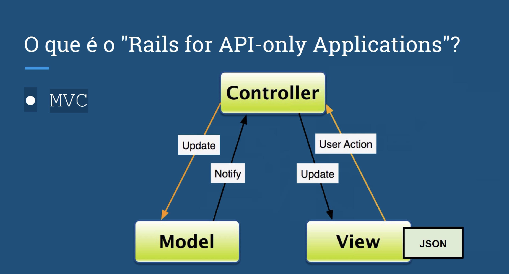

Ruby doc: https://guides.rubyonrails.org/api_app.html

Concepts:

- [ ] [Ruby] Is the programming language interpreted, the oficial website is https://www.ruby-lang.org/pt/
- [ ] [Install] Install the ruby using brew (Not use brew install ruby) https://snyk.io/blog/how-to-install-ruby-in-mac-os/
- [ ] [Rvenv] Install the Ruby versions https://github.com/rbenv/rbenv
- [ ] [Gems] Is the libraries of ruby, the oficial website is https://rubygems.org/
- [ ] [Ruby on Rails] Is the framework for Ruby and the oficial website is https://rubyonrails.org/

- Ruby using DRY (Don't repeat Yourself)

Ruby Architecture:

